# Analysis of scATAC-seq data from Taavitsainen et al. (2021) for prostate cancer:

``` r
library(Signac)
library(Seurat)
library(ggplot2)
library(patchwork)
library(Matrix)
library(AnnotationHub)
```

## Pre-processing workflow

Load the scRNA-seq data:

``` r
#For the LNCaP cell line, a human prostate adenocarcinoma cell line

filepath <- "/scratch1/dosorior/sc_RNA-seq/scRNA-ATAC-seq/scATAC_LNCaP/"

peaks <- read.table(paste0(filepath, "peaks.bed"), header = FALSE)
peaks$V4 <- paste(peaks$V1, ":", peaks$V2, "-", peaks$V3)
barcodes <- read.table(paste0(filepath, "barcodes.tsv"), header = FALSE, stringsAsFactors = FALSE)
rownames(barcodes) <- make.unique(barcodes$V1)

mtx <- readMM(file = paste0(filepath, "matrix.mtx"))
mtx <- as(object = mtx, Class = "dgCMatrix")
colnames(mtx) <- rownames(barcodes)
rownames(mtx) <- peaks$V4


chrom_assay <- CreateChromatinAssay(
  counts = mtx,
  sep = c(":", "-"),
  fragments = "/scratch1/dosorior/sc_RNA-seq/scRNA-ATAC-seq/scATAC_LNCaP/fragments.tsv.gz",
  min.cells = 10,
  min.features = 200
)

LNCaP <- CreateSeuratObject(
  counts = chrom_assay,
  assay = "peaks"
)
```

``` r
#For LNCaP cells exposed to short-term (48 h) ENZ (10 μM) treatment
filepath <- "/scratch1/dosorior/sc_RNA-seq/scRNA-ATAC-seq/scATAC_LNCaP-ENZ48/"

peaks <- read.table(paste0(filepath, "peaks.bed"), header = FALSE)
peaks$V4 <- paste(peaks$V1, ":", peaks$V2, "-", peaks$V3)
barcodes <- read.table(paste0(filepath, "barcodes.tsv"), header = FALSE, stringsAsFactors = FALSE)
rownames(barcodes) <- make.unique(barcodes$V1)

mtx_ENZ48 <- readMM(file = paste0(filepath, "matrix.mtx"))
mtx_ENZ48 <- as(object = mtx_ENZ48, Class = "dgCMatrix")
colnames(mtx_ENZ48) <- rownames(barcodes)
rownames(mtx_ENZ48) <- peaks$V4


chrom_assay_LNCaP_ENZ48 <- CreateChromatinAssay(
  counts = mtx_ENZ48,
  sep = c(":", "-"),
  fragments = "/scratch1/dosorior/sc_RNA-seq/scRNA-ATAC-seq/scATAC_LNCaP-ENZ48/fragments.tsv.gz",
  min.cells = 10,
  min.features = 200
)

LNCaP_ENZ48 <- CreateSeuratObject(
  counts = chrom_assay_LNCaP_ENZ48,
  assay = "peaks"
)
```

``` r
#For LNCaP-derived ENZ-resistant cell lines RES-A

filepath <- "/scratch1/dosorior/sc_RNA-seq/scRNA-ATAC-seq/scATAC_RESA/"

peaks <- read.table(paste0(filepath, "peaks.bed"), header = FALSE)
peaks$V4 <- paste(peaks$V1, ":", peaks$V2, "-", peaks$V3)
barcodes <- read.table(paste0(filepath, "barcodes.tsv"), header = FALSE, stringsAsFactors = FALSE)
rownames(barcodes) <- make.unique(barcodes$V1)

mtx_RESA <- readMM(file = paste0(filepath, "matrix.mtx"))
mtx_RESA <- as(object = mtx_RESA, Class = "dgCMatrix")
colnames(mtx_RESA) <- rownames(barcodes)
rownames(mtx_RESA) <- peaks$V4


chrom_assay_LNCaP_RESA <- CreateChromatinAssay(
  counts = mtx_RESA,
  sep = c(":", "-"),
  fragments = "/scratch1/dosorior/sc_RNA-seq/scRNA-ATAC-seq/scATAC_RESA/fragments.tsv.gz",
  min.cells = 10,
  min.features = 200
)

LNCaP_RESA <- CreateSeuratObject(
  counts = chrom_assay_LNCaP_RESA,
  assay = "peaks"
)
```

``` r
#For LNCaP-derived ENZ-resistant cell lines RES-B

filepath <- "/scratch1/dosorior/sc_RNA-seq/scRNA-ATAC-seq/scATAC_RESB/"

peaks <- read.table(paste0(filepath, "peaks.bed"), header = FALSE)
peaks$V4 <- paste(peaks$V1, ":", peaks$V2, "-", peaks$V3)
barcodes <- read.table(paste0(filepath, "barcodes.tsv"), header = FALSE, stringsAsFactors = FALSE)
rownames(barcodes) <- make.unique(barcodes$V1)

mtx_RESB <- readMM(file = paste0(filepath, "matrix.mtx"))
mtx_RESB <- as(object = mtx_RESB, Class = "dgCMatrix")
colnames(mtx_RESB) <- rownames(barcodes)
rownames(mtx_RESB) <- peaks$V4


chrom_assay_LNCaP_RESB <- CreateChromatinAssay(
  counts = mtx_RESB,
  sep = c(":", "-"),
  fragments = "/scratch1/dosorior/sc_RNA-seq/scRNA-ATAC-seq/scATAC_RESB/fragments.tsv.gz",
  min.cells = 10,
  min.features = 200
)

LNCaP_RESB <- CreateSeuratObject(
  counts = chrom_assay_LNCaP_RESB,
  assay = "peaks"
)
```

``` r
#Adding gene annotations for the human genome
ah <- AnnotationHub()
# extract gene annotations from EnsDb
ensdb_v98 <- ah[["AH75011"]]
annotations <- GetGRangesFromEnsDb(ensdb = ensdb_v98)
# change to UCSC style since the data was mapped to hg38
seqlevels(annotations) <- paste0('chr', seqlevels(annotations))
genome(annotations) <- "hg38"
# # add the gene information to the object
Annotation(LNCaP) <- annotations
Annotation(LNCaP_ENZ48) <- annotations
Annotation(LNCaP_RESA) <- annotations
Annotation(LNCaP_RESB) <- annotations
```

## Computing QC Metrics

``` r
#For the LNCaP cell line, a human prostate adenocarcinoma cell line
# compute nucleosome signal score per cell
LNCaP <- NucleosomeSignal(object = LNCaP)

# compute TSS enrichment score per cell
LNCaP <- TSSEnrichment(object = LNCaP)

# add fraction of reads in peaks
#Generating a peak/cell or bin/cell matrix
total_fragments <- CountFragments('/scratch1/dosorior/sc_RNA-seq/scRNA-ATAC-seq/scATAC_LNCaP/fragments.tsv.gz')
rownames(total_fragments) <- total_fragments$CB
LNCaP$fragments <- total_fragments[colnames(LNCaP), "frequency_count"]

LNCaP <- FRiP(
  object = LNCaP,
  assay = 'peaks',
  total.fragments = 'fragments'
)

# add blacklist ratio
LNCaP$blacklist_fraction <- FractionCountsInRegion(
  object = LNCaP,
  assay = 'peaks',
  regions = blacklist_hg38_unified
)
```

``` r
#For LNCaP cells exposed to short-term (48 h) ENZ (10 μM) treatment
# compute nucleosome signal score per cell
LNCaP_ENZ48 <- NucleosomeSignal(object = LNCaP_ENZ48)

# compute TSS enrichment score per cell
LNCaP_ENZ48 <- TSSEnrichment(object = LNCaP_ENZ48)

# add fraction of reads in peaks
#Generating a peak/cell or bin/cell matrix
total_fragments <- CountFragments('/scratch1/dosorior/sc_RNA-seq/scRNA-ATAC-seq/scATAC_LNCaP-ENZ48/fragments.tsv.gz')
rownames(total_fragments) <- total_fragments$CB
LNCaP_ENZ48$fragments <- total_fragments[colnames(LNCaP_ENZ48), "frequency_count"]

LNCaP_ENZ48 <- FRiP(
  object = LNCaP_ENZ48,
  assay = 'peaks',
  total.fragments = 'fragments'
)

# add blacklist ratio
LNCaP_ENZ48$blacklist_fraction <- FractionCountsInRegion(
  object = LNCaP_ENZ48,
  assay = 'peaks',
  regions = blacklist_hg38_unified
)
```

``` r
# compute nucleosome signal score per cell
LNCaP_RESA <- NucleosomeSignal(object = LNCaP_RESA)

# compute TSS enrichment score per cell
LNCaP_RESA <- TSSEnrichment(object = LNCaP_RESA)

# add fraction of reads in peaks
#Generating a peak/cell or bin/cell matrix
total_fragments <- CountFragments('/scratch1/dosorior/sc_RNA-seq/scRNA-ATAC-seq/scATAC_RESA/fragments.tsv.gz')
rownames(total_fragments) <- total_fragments$CB
LNCaP_RESA$fragments <- total_fragments[colnames(LNCaP_RESA), "frequency_count"]

LNCaP_RESA <- FRiP(
  object = LNCaP_RESA,
  assay = 'peaks',
  total.fragments = 'fragments'
)

# add blacklist ratio
LNCaP_RESA$blacklist_fraction <- FractionCountsInRegion(
  object = LNCaP_RESA,
  assay = 'peaks',
  regions = blacklist_hg38_unified
)
```

``` r
# compute nucleosome signal score per cell
LNCaP_RESB <- NucleosomeSignal(object = LNCaP_RESB)

# compute TSS enrichment score per cell
LNCaP_RESB <- TSSEnrichment(object = LNCaP_RESB)

# add fraction of reads in peaks
#Generating a peak/cell or bin/cell matrix
total_fragments <- CountFragments('/scratch1/dosorior/sc_RNA-seq/scRNA-ATAC-seq/scATAC_RESB/fragments.tsv.gz')
rownames(total_fragments) <- total_fragments$CB
LNCaP_RESB$fragments <- total_fragments[colnames(LNCaP_RESB), "frequency_count"]

LNCaP_RESB <- FRiP(
  object = LNCaP_RESB,
  assay = 'peaks',
  total.fragments = 'fragments'
)

# add blacklist ratio
LNCaP_RESB$blacklist_fraction <- FractionCountsInRegion(
  object = LNCaP_RESB,
  assay = 'peaks',
  regions = blacklist_hg38_unified
)
```

We will visualize different QC metrics for can LNCaP:

Density scatter plot for the transcription starting site (TSS) scores
relative to the count peaks:

``` r
DensityScatter(LNCaP, x = 'nCount_peaks', y = 'TSS.enrichment', log_x = TRUE, quantiles = TRUE)
```

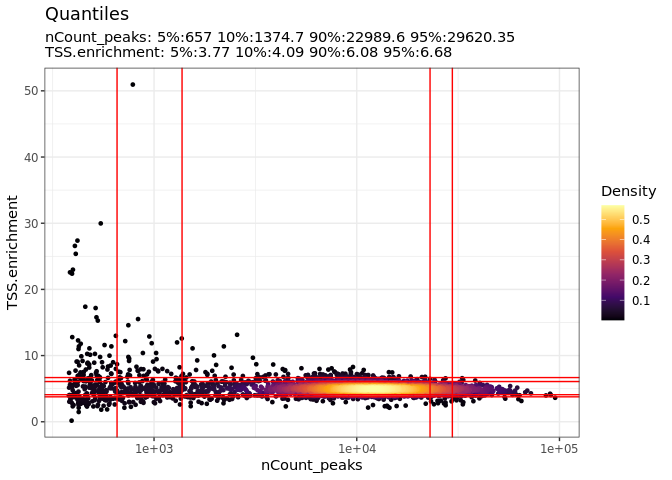<!-- -->

Histogram of fragment lengths for cells with low (left) or high (right)
nucleosomal signal strength:

``` r
LNCaP$nucleosome_group <- ifelse(LNCaP$nucleosome_signal > 4, 'NS > 4', 'NS < 4')
FragmentHistogram(object = LNCaP, group.by = 'nucleosome_group')
```

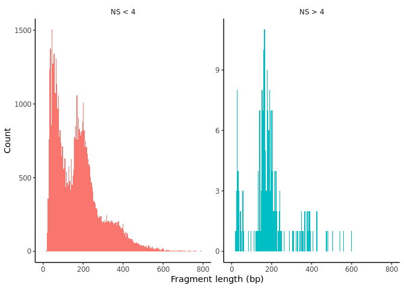<!-- -->

``` r
VlnPlot(
  object = LNCaP,
  features = c('nCount_peaks', 'TSS.enrichment', 'blacklist_fraction', 'nucleosome_signal', 'FRiP'),
  pt.size = 0.1,
  ncol = 5
)
```

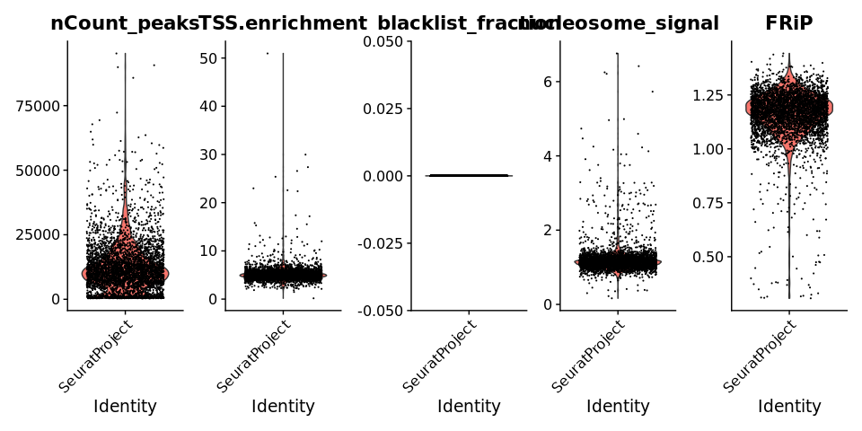<!-- -->

Based on these QC metrics, we remove outliers:

``` r
LNCaP <- subset(
  x = LNCaP,
  subset = nCount_peaks < 30000 &
    FRiP > 0.8 &
    blacklist_fraction < 0.01 &
    nucleosome_signal < 2 &
    TSS.enrichment < 8
)
LNCaP
```

    ## An object of class Seurat 
    ## 113945 features across 3696 samples within 1 assay 
    ## Active assay: peaks (113945 features, 0 variable features)
    ##  2 layers present: counts, data

For LNCaP cells exposed to short-term (48 h) ENZ (10 μM) treatment:

``` r
VlnPlot(
  object = LNCaP_ENZ48,
  features = c('nCount_peaks', 'TSS.enrichment', 'blacklist_fraction', 'nucleosome_signal', 'FRiP'),
  pt.size = 0.1,
  ncol = 5
)
```

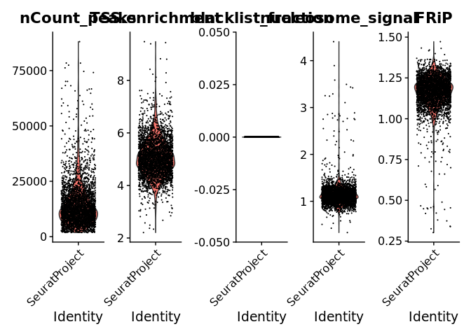<!-- -->

Based on these QC metrics, we remove outliers:

``` r
LNCaP_ENZ48 <- subset(
  x = LNCaP_ENZ48,
  subset = nCount_peaks < 30000 &
    FRiP > 0.8 &
    blacklist_fraction < 0.01 &
    nucleosome_signal < 1.5 &
    TSS.enrichment < 7
)
LNCaP_ENZ48
```

    ## An object of class Seurat 
    ## 111712 features across 3025 samples within 1 assay 
    ## Active assay: peaks (111712 features, 0 variable features)
    ##  2 layers present: counts, data

For LNCaP-derived ENZ-resistant cell lines RES-A:

``` r
VlnPlot(
  object = LNCaP_RESA,
  features = c('nCount_peaks', 'TSS.enrichment', 'blacklist_fraction', 'nucleosome_signal', 'FRiP'),
  pt.size = 0.1,
  ncol = 5
)
```

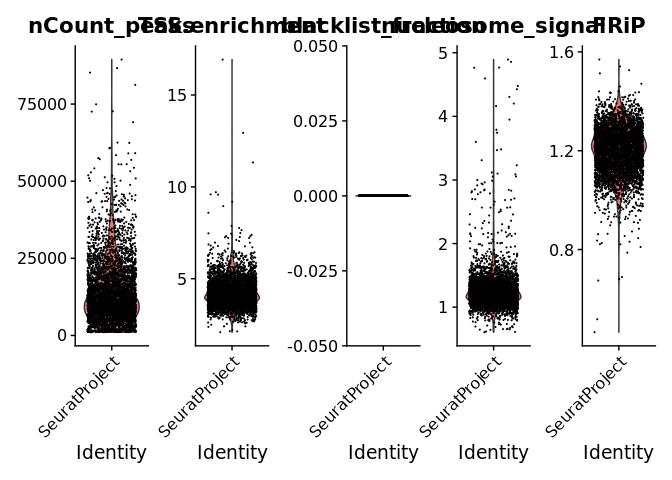<!-- -->

Based on these QC metrics, we remove outliers:

``` r
LNCaP_RESA <- subset(
  x = LNCaP_RESA,
  subset = nCount_peaks < 30000 &
    FRiP > 1.0 &
    blacklist_fraction < 0.01 &
    nucleosome_signal < 1.8 &
    TSS.enrichment < 7
)
LNCaP_RESA
```

    ## An object of class Seurat 
    ## 162011 features across 3932 samples within 1 assay 
    ## Active assay: peaks (162011 features, 0 variable features)
    ##  2 layers present: counts, data

For LNCaP-derived ENZ-resistant cell lines RES-B:

``` r
VlnPlot(
  object = LNCaP_RESB,
  features = c('nCount_peaks', 'TSS.enrichment', 'blacklist_fraction', 'nucleosome_signal', 'FRiP'),
  pt.size = 0.1,
  ncol = 5
)
```

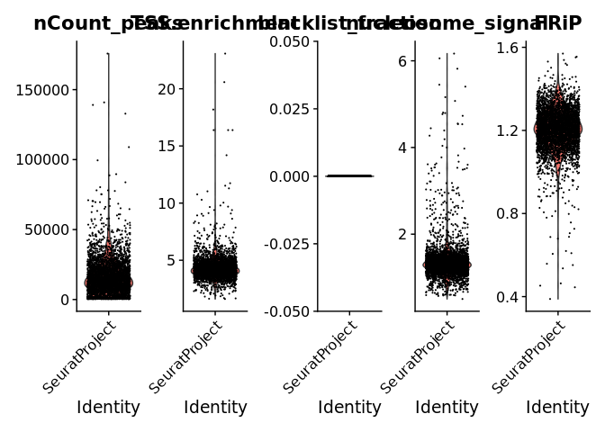<!-- -->

Based on these QC metrics, we remove outliers:

``` r
LNCaP_RESB <- subset(
  x = LNCaP_RESB,
  subset = nCount_peaks < 30000 &
    FRiP > 1.0 &
    blacklist_fraction < 0.01 &
    nucleosome_signal < 1.8 &
    TSS.enrichment < 7
)
LNCaP_RESB
```

    ## An object of class Seurat 
    ## 134409 features across 3366 samples within 1 assay 
    ## Active assay: peaks (134409 features, 0 variable features)
    ##  2 layers present: counts, data

## Normalization and linear dimensional reduction

For the LNCaP cell line:

``` r
LNCaP <- RunTFIDF(LNCaP)
LNCaP <- FindTopFeatures(LNCaP, min.cutoff = 'q0')
LNCaP <- RunSVD(LNCaP)
```

For LNCaP cells exposed to short-term (48 h) ENZ (10 μM) treatment:

``` r
LNCaP_ENZ48 <- RunTFIDF(LNCaP_ENZ48)
LNCaP_ENZ48 <- FindTopFeatures(LNCaP_ENZ48, min.cutoff = 'q0')
LNCaP_ENZ48 <- RunSVD(LNCaP_ENZ48)
```

For LNCaP-derived ENZ-resistant cell lines RES-A:

``` r
LNCaP_RESA <- RunTFIDF(LNCaP_RESA)
LNCaP_RESA <- FindTopFeatures(LNCaP_RESA, min.cutoff = 'q0')
LNCaP_RESA <- RunSVD(LNCaP_RESA)
```

For LNCaP-derived ENZ-resistant cell lines RES-B:

``` r
LNCaP_RESB <- RunTFIDF(LNCaP_RESB)
LNCaP_RESB <- FindTopFeatures(LNCaP_RESB, min.cutoff = 'q0')
LNCaP_RESB <- RunSVD(LNCaP_RESB)
```

Visualization for the correlation between each LSI component and
sequencing depth.

For the LNCaP cell line:

``` r
DepthCor(LNCaP)
```

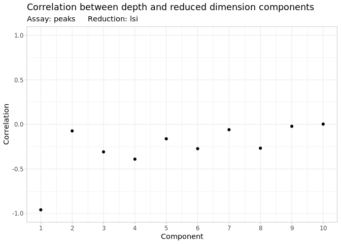<!-- --> For
LNCaP cells exposed to short-term (48 h) ENZ (10 μM) treatment:

``` r
DepthCor(LNCaP_ENZ48)
```

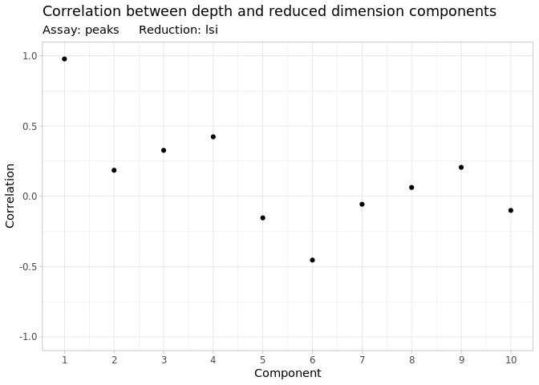<!-- --> For
LNCaP-derived ENZ-resistant cell lines RES-A:

``` r
DepthCor(LNCaP_RESA)
```

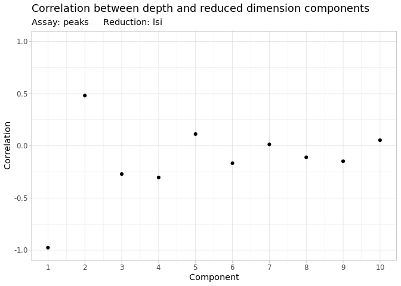<!-- -->

For LNCaP-derived ENZ-resistant cell lines RES-B:

``` r
DepthCor(LNCaP_RESB)
```

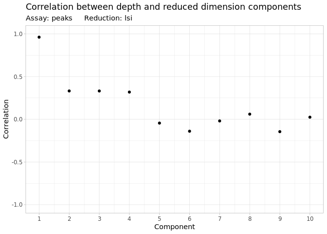<!-- -->

## Non-linear dimension reduction and clustering

For the LNCaP cell line:

``` r
LNCaP <- RunUMAP(object = LNCaP, reduction = 'lsi', dims = 2:30)
LNCaP <- FindNeighbors(object = LNCaP, reduction = 'lsi', dims = 2:30)
LNCaP <- FindClusters(object = LNCaP, verbose = FALSE, algorithm = 3)
DimPlot(object = LNCaP, label = TRUE) + NoLegend()
```

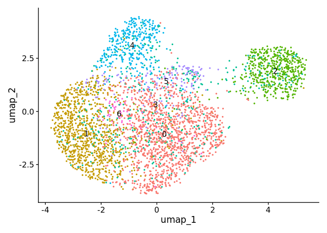<!-- --> For
LNCaP cells exposed to short-term (48 h) ENZ (10 μM) treatment:

``` r
LNCaP_ENZ48 <- RunUMAP(object = LNCaP_ENZ48, reduction = 'lsi', dims = 2:30)
LNCaP_ENZ48 <- FindNeighbors(object = LNCaP_ENZ48, reduction = 'lsi', dims = 2:30)
LNCaP_ENZ48 <- FindClusters(object = LNCaP_ENZ48, verbose = FALSE, algorithm = 3)
DimPlot(object = LNCaP_ENZ48, label = TRUE) + NoLegend()
```

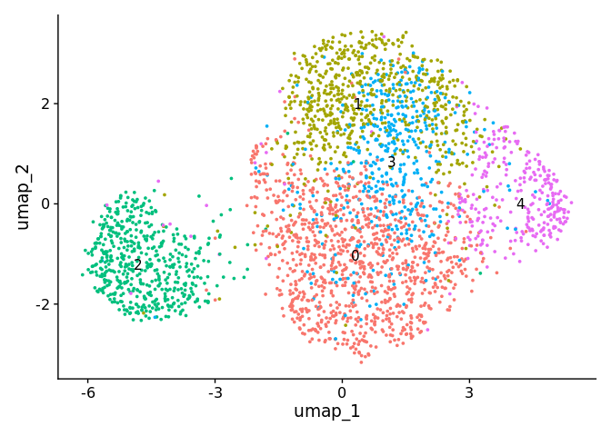<!-- --> For
LNCaP-derived ENZ-resistant cell lines RES-A:

``` r
LNCaP_RESA <- RunUMAP(object = LNCaP_RESA, reduction = 'lsi', dims = 2:30)
LNCaP_RESA <- FindNeighbors(object = LNCaP_RESA, reduction = 'lsi', dims = 2:30)
LNCaP_RESA <- FindClusters(object = LNCaP_RESA, verbose = FALSE, algorithm = 3)
DimPlot(object = LNCaP_RESA, label = TRUE) + NoLegend()
```

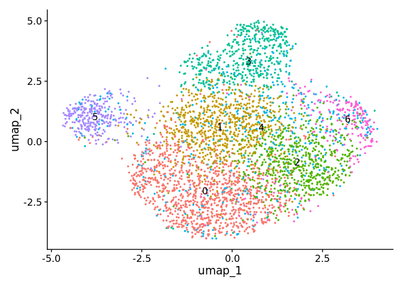<!-- --> For
LNCaP-derived ENZ-resistant cell lines RES-B:

``` r
LNCaP_RESB <- RunUMAP(object = LNCaP_RESB, reduction = 'lsi', dims = 2:30)
LNCaP_RESB <- FindNeighbors(object = LNCaP_RESB, reduction = 'lsi', dims = 2:30)
DimPlot(object = LNCaP_RESB, label = TRUE) + NoLegend()
```

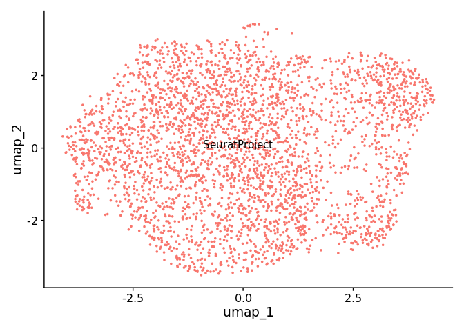<!-- -->

## Create a gene activity matrix

We will use GeneActivity to assign names to genomic regions.

``` r
gene.activities <- GeneActivity(LNCaP)
gene.activities_LNCaP_ENZ48 <- GeneActivity(LNCaP_ENZ48)
gene.activities_LNCaP_RESA <- GeneActivity(LNCaP_RESA)
gene.activities_LNCaP_RESB <- GeneActivity(LNCaP_RESB)
```

Add the gene activity matrix to the Seurat object as a new assay and
normalize it:

For the LNCaP cell line:

``` r
# 
LNCaP[['RNA']] <- CreateAssayObject(counts = gene.activities)
LNCaP <- NormalizeData(
  object = LNCaP,
  assay = 'RNA',
  normalization.method = 'LogNormalize',
  scale.factor = median(LNCaP$nCount_RNA)
)
```

For LNCaP cells exposed to short-term (48 h) ENZ (10 μM) treatment:

``` r
# 
LNCaP_ENZ48[['RNA']] <- CreateAssayObject(counts = gene.activities_LNCaP_ENZ48)
LNCaP_ENZ48 <- NormalizeData(
  object = LNCaP_ENZ48,
  assay = 'RNA',
  normalization.method = 'LogNormalize',
  scale.factor = median(LNCaP_ENZ48$nCount_RNA)
)
```

For LNCaP-derived ENZ-resistant cell lines RES-A:

``` r
# 
LNCaP_RESA[['RNA']] <- CreateAssayObject(counts = gene.activities_LNCaP_RESA)
LNCaP_RESA <- NormalizeData(
  object = LNCaP_RESA,
  assay = 'RNA',
  normalization.method = 'LogNormalize',
  scale.factor = median(LNCaP_RESA$nCount_RNA)
)
```

For LNCaP-derived ENZ-resistant cell lines RES-B:

``` r
# 
LNCaP_RESB[['RNA']] <- CreateAssayObject(counts = gene.activities_LNCaP_RESB)
LNCaP_RESB <- NormalizeData(
  object = LNCaP_RESB,
  assay = 'RNA',
  normalization.method = 'LogNormalize',
  scale.factor = median(LNCaP_RESB$nCount_RNA)
)
```

We can now determine the activities of individual genes within the UMAP
data clusters:

For the LNCaP cell line:

``` r
DefaultAssay(LNCaP) <- 'RNA'

FeaturePlot(
  object = LNCaP,
  features = c('MS4A1', 'CD3D', 'LEF1', 'NKG7', 'TREM1', 'LYZ'),
  pt.size = 0.1,
  max.cutoff = 'q95',
  ncol = 3
)
```

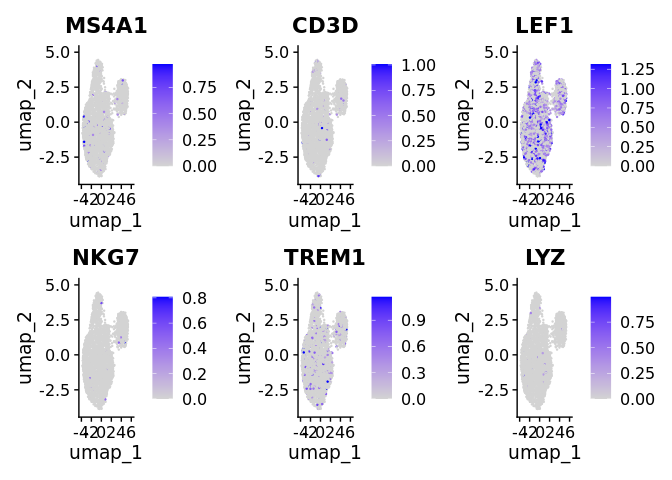<!-- -->

For LNCaP cells exposed to short-term (48 h) ENZ (10 μM) treatment:

``` r
DefaultAssay(LNCaP_ENZ48) <- 'RNA'

FeaturePlot(
  object = LNCaP_ENZ48,
  features = c('MS4A1', 'CD3D', 'LEF1', 'NKG7', 'TREM1', 'LYZ'),
  pt.size = 0.1,
  max.cutoff = 'q95',
  ncol = 3
)
```

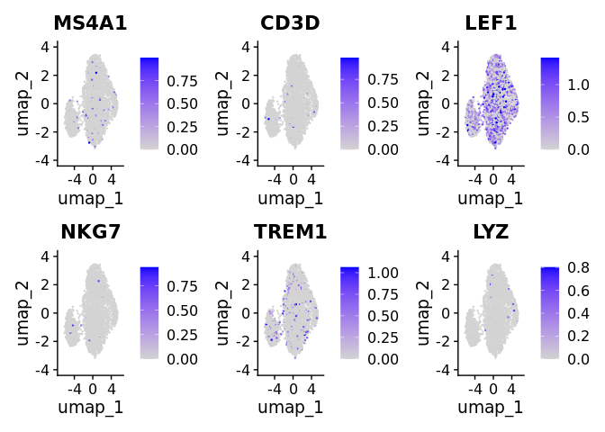<!-- -->

For LNCaP-derived ENZ-resistant cell lines RES-A:

``` r
DefaultAssay(LNCaP_RESA) <- 'RNA'

FeaturePlot(
  object = LNCaP_RESA,
  features = c('MS4A1', 'CD3D', 'LEF1', 'NKG7', 'TREM1', 'LYZ'),
  pt.size = 0.1,
  max.cutoff = 'q95',
  ncol = 3
)
```

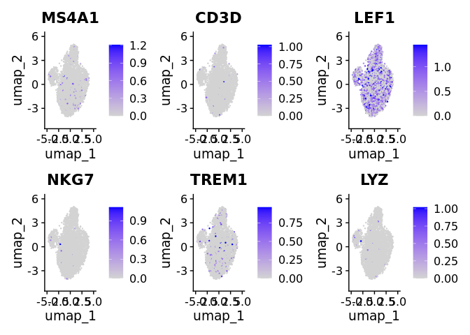<!-- --> For
LNCaP-derived ENZ-resistant cell lines RES-B:

``` r
DefaultAssay(LNCaP_RESB) <- 'RNA'

FeaturePlot(
  object = LNCaP_RESB,
  features = c('MS4A1', 'CD3D', 'LEF1', 'NKG7', 'TREM1', 'LYZ'),
  pt.size = 0.1,
  max.cutoff = 'q95',
  ncol = 3
)
```

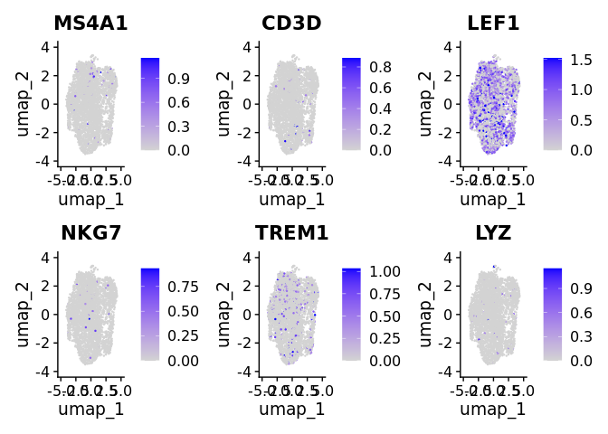<!-- --> \##
Integration with scRNA-seq data

``` r
# Load the pre-processed scRNA-seq data
LNCaP_rna <- readRDS("/scratch1/dosorior/sc_RNA-seq/scRNA-ATAC-seq/scRNAseq_LNCaP.seu.rds")
LNCaP_ENZ48_rna <- readRDS("/scratch1/dosorior/sc_RNA-seq/scRNA-ATAC-seq/scRNAseq_LNCaP_ENZ48.seu.rds")
LNCaP_RESA_rna <- readRDS("/scratch1/dosorior/sc_RNA-seq/scRNA-ATAC-seq/scRNAseq_LNCaP_RESA.seu.rds")
LNCaP_rna <- UpdateSeuratObject(LNCaP_rna)
LNCaP_ENZ48_rna <- UpdateSeuratObject(LNCaP_ENZ48_rna)
LNCaP_RESA_rna <- UpdateSeuratObject(LNCaP_RESA_rna)
```

``` r
#transfering anchors
# LNCaP
transfer.anchors_LNCaP <- FindTransferAnchors(
  reference = LNCaP_rna,
  query = LNCaP,
  reduction = 'cca'
)
#LNCaP_ENZ48
transfer.anchors_LNCaP_ENZ48 <- FindTransferAnchors(
  reference = LNCaP_ENZ48_rna,
  query = LNCaP_ENZ48,
  reduction = 'cca'
)
#LNCaP_RESA
transfer.anchors_LNCaP_RESA <- FindTransferAnchors(
  reference = LNCaP_RESA_rna,
  query = LNCaP_RESA,
  reduction = 'cca'
)
```

``` r
#Extract labels
# LNCaP
predicted.labels_LNCaP <- TransferData(
  anchorset = transfer.anchors_LNCaP,
  refdata = LNCaP_rna$SingleR.labels,
  weight.reduction = LNCaP[['lsi']],
  dims = 2:30
)
# LNCaP_ENZ48
predicted.labels_LNCaP_ENZ48 <- TransferData(
  anchorset = transfer.anchors_LNCaP_ENZ48,
  refdata = LNCaP_ENZ48_rna$SingleR.labels,
  weight.reduction = LNCaP_ENZ48[['lsi']],
  dims = 2:30
)
# LNCaP_RESA
predicted.labels_LNCaP_RESA <- TransferData(
  anchorset = transfer.anchors_LNCaP_RESA,
  refdata = LNCaP_RESA_rna$SingleR.labels,
  weight.reduction = LNCaP_RESA[['lsi']],
  dims = 2:30
)
```

``` r
#Add labels to scATAC data
LNCaP <- AddMetaData(object = LNCaP, metadata = predicted.labels_LNCaP)
LNCaP_ENZ48 <- AddMetaData(object = LNCaP_ENZ48, metadata = predicted.labels_LNCaP_ENZ48)
LNCaP_RESA <- AddMetaData(object = LNCaP_RESA, metadata = predicted.labels_LNCaP_RESA)
```

``` r
#plotting for LNCaP
plot1 <- DimPlot(
  object = LNCaP_rna,
  group.by = 'SingleR.labels',
  label = TRUE,
  repel = TRUE) + NoLegend() + ggtitle('scRNA-seq')

plot2 <- DimPlot(
  object = LNCaP,
  group.by = 'predicted.id',
  label = TRUE,
  repel = TRUE) + NoLegend() + ggtitle('scATAC-seq')

plot1 + plot2
```

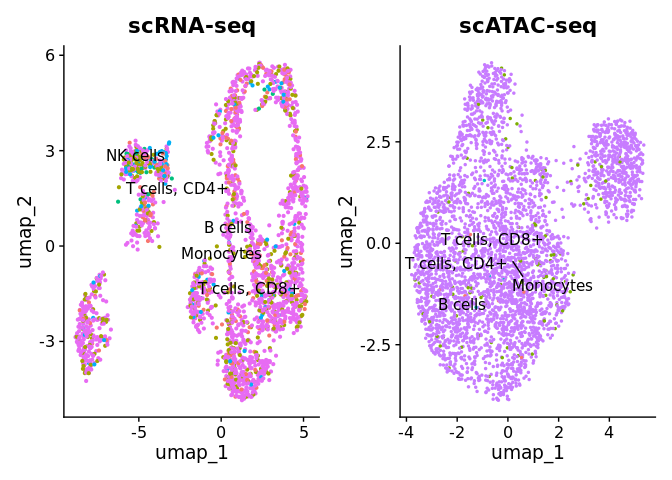<!-- -->

``` r
#plotting for LNCaP_ENZ48
plot1 <- DimPlot(
  object = LNCaP_ENZ48_rna,
  group.by = 'SingleR.labels',
  label = TRUE,
  repel = TRUE) + NoLegend() + ggtitle('scRNA-seq')

plot2 <- DimPlot(
  object = LNCaP_ENZ48,
  group.by = 'predicted.id',
  label = TRUE,
  repel = TRUE) + NoLegend() + ggtitle('scATAC-seq')

plot1 + plot2
```

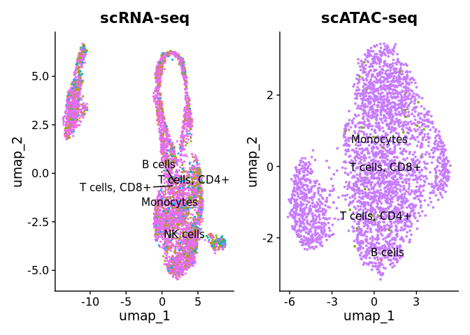<!-- -->

``` r
#plotting for LNCaP_RESA
plot1 <- DimPlot(
  object = LNCaP_RESA_rna,
  group.by = 'SingleR.labels',
  label = TRUE,
  repel = TRUE) + NoLegend() + ggtitle('scRNA-seq')

plot2 <- DimPlot(
  object = LNCaP_RESA,
  group.by = 'predicted.id',
  label = TRUE,
  repel = TRUE) + NoLegend() + ggtitle('scATAC-seq')

plot1 + plot2
```

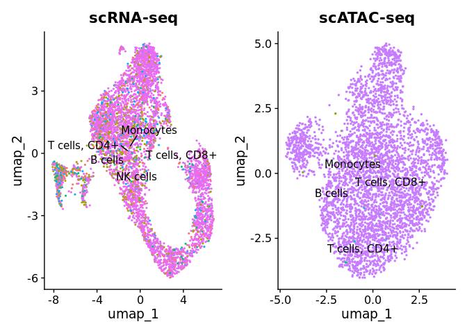<!-- --> It seems
like for this particular dataset, despite the cells being adecuately
classified by the DatabaseImmuneCellExpressionData reference dataset
from celldex, the labels are not very useful at correlating the clusters
between scRNA-seq and scATAC-seq.

## Find differentially accessible peaks between cell types

To find differentially accessible regions between clusters of cells, we
can perform a differential accessibility (DA) test. A simple approach is
to perform a Wilcoxon rank sum test, and the presto package has
implemented an extremely fast Wilcoxon test that can be run on a Seurat
object.

``` r
#Installing Presto
# if (!requireNamespace("remotes", quietly = TRUE))
#   install.packages('remotes')
# remotes::install_github('immunogenomics/presto')
```

``` r
# change cell identities to the per-cell predicted labels
Idents(LNCaP) <- LNCaP$predicted.id
Idents(LNCaP_ENZ48) <- LNCaP_ENZ48$predicted.id
Idents(LNCaP_RESA) <- LNCaP_RESA$predicted.id

# change back to working with peaks instead of gene activities
DefaultAssay(LNCaP) <- 'peaks'
DefaultAssay(LNCaP_ENZ48) <- 'peaks'
DefaultAssay(LNCaP_RESA) <- 'peaks'

#We will compare Monocytes and T cells, CD4+
# wilcox is the default option for test.use
#LNCaP
da_peaks_LNCaP <- FindMarkers(
  object = LNCaP,
  ident.1 = "Monocytes",
  ident.2 = "T cells, CD4+",
  test.use = 'wilcox',
  min.pct = 0.1
)

head(da_peaks_LNCaP)
```

    ##                                  p_val avg_log2FC pct.1 pct.2    p_val_adj
    ## chr5 -30207229-30207964   4.151256e-17 -14.547766 0.000  0.75 4.730148e-12
    ## chr20 -34255533-34256178  4.450326e-13  -6.406649 0.011  0.75 5.070924e-08
    ## chr1 -197380349-197381095 9.253358e-12 -13.759798 0.000  0.50 1.054374e-06
    ## chr1 -199865618-199866019 9.253358e-12 -14.343960 0.000  0.50 1.054374e-06
    ## chr1 -239876460-239877069 9.253358e-12 -14.035081 0.000  0.50 1.054374e-06
    ## chr2 -558641-559274       9.253358e-12 -14.621530 0.000  0.50 1.054374e-06

``` r
#LNCaP_ENZ48
da_peaks_LNCaP_ENZ48 <- FindMarkers(
  object = LNCaP_ENZ48,
  ident.1 = "Monocytes",
  ident.2 = "T cells, CD8+",
  test.use = 'wilcox',
  min.pct = 0.1
)

#LNCaP_RESA
da_peaks_LNCaP_RESA <- FindMarkers(
  object = LNCaP_RESA,
  ident.1 = "Monocytes",
  ident.2 = "T cells, CD4+",
  test.use = 'wilcox',
  min.pct = 0.1
)
```

``` r
plot1 <- VlnPlot(
  object = LNCaP,
  features = rownames(da_peaks_LNCaP)[1],
  pt.size = 0.1,
  idents = c("Monocytes","T cells, CD4+")
)
plot2 <- FeaturePlot(
  object = LNCaP,
  features = rownames(da_peaks_LNCaP)[1],
  pt.size = 0.1
)

plot1 | plot2
```

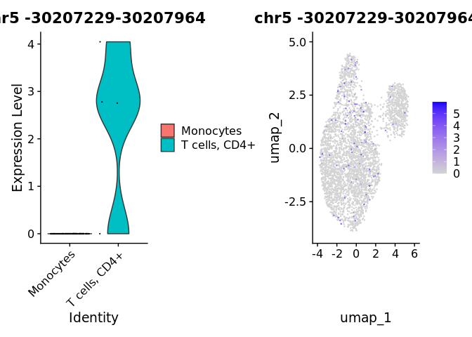<!-- -->
