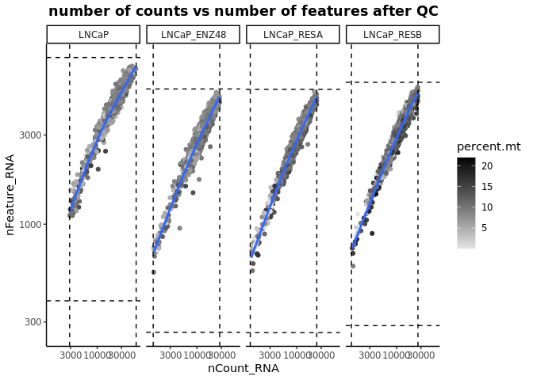
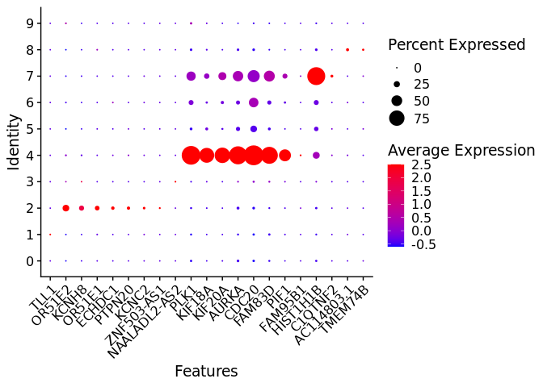
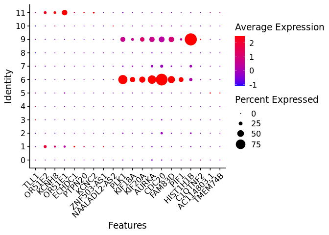

# Analysis of scRNA-seq data from Taavitsainen et al. (2021) for prostate cancer:

Installing the required packages:

``` r
# install.packages("data.table")
# install.packages('Seurat')
# if (!require("BiocManager", quietly = TRUE))
# install.packages("BiocManager")
# BiocManager::install("scuttle")
# BiocManager::install("edgeR")
# BiocManager::install("scDblFinder")
# BiocManager::install("celldex")
# BiocManager::install("SingleR")
# BiocManager::install("scRNAseq")
# install.packages("mgcv")

# setRepositories(ind = 1:3, addURLs = c('https://satijalab.r-universe.dev', 'https://bnprks.r-universe.dev/'))
# install.packages(c("BPCells", "presto", "glmGamPoi"))
# Install the remotes package
# if (!requireNamespace("remotes", quietly = TRUE)) {
  # install.packages("remotes")
# }
# install.packages('Signac')
# remotes::install_github("mojaveazure/seurat-disk")
# remotes::install_github("satijalab/seurat-data", quiet = TRUE)
# remotes::install_github("satijalab/azimuth", quiet = TRUE)
# remotes::install_github("satijalab/seurat-wrappers", quiet = TRUE)
```

Loading required libraries:

``` r
library(Seurat)
library(tidyverse)
library(scuttle)
library(scDblFinder)
library(ggplot2)
library(writexl)
library(SeuratDisk)
library(celldex)
library(sctransform)
library(readxl)
library(data.table)
library(mgcv)
library(SingleR)
library(scRNAseq)
```

Load the scRNA-seq data:

``` r
#For the LNCaP cell line, a human prostate adenocarcinoma cell line
LNCaP <- Read10X(data.dir = '/scratch1/dosorior/sc_RNA-seq/scRNA-ATAC-seq/sc_LNCaP')
#For LNCaP cells exposed to short-term (48 h) ENZ (10 μM) treatment
LNCaP_ENZ48 <- Read10X(data.dir = '/scratch1/dosorior/sc_RNA-seq/scRNA-ATAC-seq/sc_LNCaP-ENZ48')
#For LNCaP-derived ENZ-resistant cell lines RES-A
LNCaP_RESA <- Read10X(data.dir = '/scratch1/dosorior/sc_RNA-seq/scRNA-ATAC-seq/sc_RESA')
#For LNCaP-derived ENZ-resistant cell lines RES-B
LNCaP_RESB <- Read10X(data.dir = '/scratch1/dosorior/sc_RNA-seq/scRNA-ATAC-seq/sc_RESB')
```

Initializing the Seurat object

``` r
# Initialize the Seurat objects with the raw (non-normalized data).
LNCaP.seu <- CreateSeuratObject(counts = LNCaP, project = "LNCaP", min.cells = 3, min.features = 200)
LNCaP_ENZ48.seu <- CreateSeuratObject(counts = LNCaP_ENZ48, project = "LNCaP_ENZ48", min.cells = 3, min.features = 200)
LNCaP_RESA.seu <- CreateSeuratObject(counts = LNCaP_RESA, project = "LNCaP_RESA", min.cells = 3, min.features = 200)
LNCaP_RESB.seu <- CreateSeuratObject(counts = LNCaP_RESB, project = "LNCaP_RESB", min.cells = 3, min.features = 200)
#Add a column with perent of mitochondrial genes
LNCaP.seu[["percent.mt"]] <- PercentageFeatureSet(LNCaP.seu, pattern = "^MT-")
LNCaP_ENZ48.seu[["percent.mt"]] <- PercentageFeatureSet(LNCaP_ENZ48.seu, pattern = "^MT-")
LNCaP_RESA.seu[["percent.mt"]] <- PercentageFeatureSet(LNCaP_RESA.seu, pattern = "^MT-")
LNCaP_RESB.seu[["percent.mt"]] <- PercentageFeatureSet(LNCaP_RESB.seu, pattern = "^MT-")
LNCaP.seu
```

    ## An object of class Seurat 
    ## 17694 features across 2357 samples within 1 assay 
    ## Active assay: RNA (17694 features, 0 variable features)
    ##  1 layer present: counts

## QC and selecting cells

``` r
seurat_list <- c('LNCaP' = LNCaP.seu, 'LNCaP_ENZ48' = LNCaP_ENZ48.seu, 'LNCaP_RESA' = LNCaP_RESA.seu, 'LNCaP_RESB' = LNCaP_RESB.seu)

finddoublet <- function(seurat_obj){
  set.seed(34) 
  sce_obj <- as.SingleCellExperiment(seurat_obj)
  sce_obj <- scDblFinder(sce_obj)
  seu_new <- as.Seurat(sce_obj, data = NULL)
  return(seu_new)
}

#Define function to calculate normalized median absolute deviation
nMAD <- function(x,nmads=3){
  xm <- median(x)
  md <- median(abs(x-xm))
  mads <- xm+nmads*md
  return(mads)
}
```

``` r
## profiling information for QC and perform QC
nmad=5
count = 1
sample.nfeature.cut <- c()
sample.ncount.cut <- c()
sample.mt.cut <- c()
seurat_list_qc <- c()
for (obj in seurat_list){
  print(names(seurat_list)[count])
  # visual nfeature ncount percent.mt
  print(VlnPlot(obj, features = c("nFeature_RNA", "nCount_RNA", "percent.mt"), ncol = 3))
  # add doublet info
  obj = finddoublet(obj)
  # nMAD cut
  nfeature.upcut <- ceiling(nMAD(obj$nFeature_RNA,nmad))
  ncount.upcut <- ceiling(nMAD(obj$nCount_RNA,nmad))
  permt.upcut <- ceiling(nMAD(obj$percent.mt,nmad))
  sample.nfeature.cut <- c(sample.nfeature.cut, nfeature.upcut)
  sample.ncount.cut <- c(sample.ncount.cut, ncount.upcut)
  sample.mt.cut <- c(sample.mt.cut,permt.upcut)
  #perform QC
  obj.filt <- subset(obj, subset = nFeature_RNA <= nfeature.upcut & nFeature_RNA > nfeature.upcut/20)
  obj.filt <- subset(obj.filt, subset = nCount_RNA <= ncount.upcut & nCount_RNA > ncount.upcut/20)
  obj.filt <- subset(obj.filt, subset = percent.mt <= min(permt.upcut,25))
  obj.filt <- subset(obj.filt, subset = scDblFinder.class %in% c('singlet'))
  Idents(obj.filt) <- names(seurat_list)[count]
  #visualize again
  print(VlnPlot(obj.filt, features = c("nFeature_RNA", "nCount_RNA", "percent.mt"), ncol = 3))
  seurat_list_qc <- c(seurat_list_qc,obj.filt)
  count = count + 1
}
```

    ## [1] "LNCaP"

<!-- --><!-- -->

    ## [1] "LNCaP_ENZ48"

<!-- --><!-- -->

    ## [1] "LNCaP_RESA"

<!-- --><!-- -->

    ## [1] "LNCaP_RESB"

<!-- --><!-- -->

``` r
names(sample.mt.cut) <- names(seurat_list)
names(sample.ncount.cut) <- names(seurat_list)
names(sample.nfeature.cut) <- names(seurat_list)
names(seurat_list_qc) <- names(seurat_list)
```

We will filter out cell with abnormally high or low numbers of counts:

``` r
samples <- names(seurat_list)
samples.ncount.cut.summary <- data.frame(orig.ident=c(samples,samples), 
                                         types=c(rep('up.cut',length(samples)),
                                                 rep('down.cut',length(samples))),
                                         values=c(sample.ncount.cut,sample.ncount.cut/20))
samples.nfeature.cut.summary <- data.frame(orig.ident=c(samples,samples), 
                                           types=c(rep('up.cut',length(samples)),
                                                   rep('down.cut',length(samples))),
                                           values=c(sample.nfeature.cut,sample.nfeature.cut/20))
# mt don't need lower cut
samples.mt.cut.summary <- data.frame(orig.ident=c(samples), 
                                     types=c(rep('up.cut',length(samples))),
                                     values=c(sample.mt.cut))
```

## Generating comparative plots for before and after QC:

### Before QC

Visualizing total number of cells:

``` r
merge.seu <- merge(x=seurat_list[[1]], y=seurat_list[2:length(seurat_list_qc)])
metadata <- merge.seu@meta.data
# Visualize the number of cell counts per sample
metadata %>% 
  ggplot(aes(x=orig.ident, fill=orig.ident)) + 
  geom_bar() +
  theme_classic() +
  theme(axis.text.x = element_text(angle = 45, vjust = 1, hjust=1)) +
  theme(plot.title = element_text(hjust=0.5, face="bold")) +
  ggtitle("Number of cells before QC")
```

<!-- --> Density
plot of total counts per cell type:

``` r
metadata %>% 
  ggplot(aes(color=orig.ident, x=nCount_RNA, fill= orig.ident)) + 
  geom_density(alpha=.5) +
  scale_x_log10() +
  theme_classic() +
  geom_vline(data = samples.ncount.cut.summary, 
             aes(xintercept = values), 
             linetype = "dashed",show.legend = F) +
  facet_wrap(~orig.ident,ncol = 4) +
  scale_x_continuous(labels = scales::scientific) +
  theme(plot.title = element_text(hjust=0.5, face="bold")) +
  ggtitle("Number of counts before QC")
```


Density plot of total features per cell type:

``` r
metadata %>% 
  ggplot(aes(color=orig.ident, x=nFeature_RNA, fill= orig.ident)) + 
  geom_density(alpha=.5) +
  scale_x_log10() +
  theme_classic() +
  geom_vline(data = samples.nfeature.cut.summary, 
             aes(xintercept = values), 
             linetype = "dashed",show.legend = F) +
  facet_wrap(~orig.ident,ncol = 4) +
  theme(plot.title = element_text(hjust=0.5, face="bold")) +
  ggtitle("Number of features before QC")
```

<!-- --> Density
plot of percentage of mitochondrial genes per cell type:

``` r
metadata %>% 
  ggplot(aes(color=orig.ident, x=percent.mt, fill= orig.ident)) + 
  geom_density(alpha=.5) +
  scale_x_log10() +
  theme_classic() +
  geom_vline(data = samples.mt.cut.summary, 
             aes(xintercept = values), 
             linetype = "dashed",show.legend = F) +
  facet_wrap(~orig.ident,ncol = 4) +
  theme(plot.title = element_text(hjust=0.5, face="bold")) +
  ggtitle("Percent of mitochondrial genes before QC")
```

<!-- -->

Plotting the relationship between counts and features:

``` r
metadata %>% 
  ggplot(aes(x=nCount_RNA, y=nFeature_RNA, color=percent.mt)) + 
  geom_point() + 
  scale_colour_gradient(low = "gray90", high = "black") +
  geom_smooth(se=TRUE,level=0.9) +
  scale_x_log10() +
  scale_y_log10() +
  theme_classic() +
  geom_vline(data = samples.ncount.cut.summary, 
             aes(xintercept = values), 
             linetype = "dashed",show.legend = F)+
  geom_hline(data = samples.nfeature.cut.summary, 
             aes(yintercept = values), 
             linetype = "dashed",show.legend = F) +
  facet_wrap(~orig.ident,ncol = 4) +
  theme(plot.title = element_text(hjust=0.5, face="bold")) +
  ggtitle("number of counts vs number of features before QC")
```

<!-- -->

### After QC

Visualizing total number of cells:

``` r
merge.qc.seu <- merge(x=seurat_list_qc[[1]], y=seurat_list_qc[2:length(seurat_list_qc)])

metadata.qc <- merge.qc.seu@meta.data
metadata.qc %>% 
  ggplot(aes(x=orig.ident, fill=orig.ident)) + 
  geom_bar() +
  theme_classic() +
  theme(axis.text.x = element_text(angle = 45, vjust = 1, hjust=1)) +
  theme(plot.title = element_text(hjust=0.5, face="bold")) +
  ggtitle("Number of cells after QC")
```

<!-- --> Density
plot of total counts per cell type:

``` r
metadata.qc %>% 
  ggplot(aes(color=orig.ident, x=nCount_RNA, fill= orig.ident)) + 
  geom_density(alpha=.5) +
  scale_x_log10() +
  theme_classic() +
  geom_vline(data = samples.ncount.cut.summary, 
             aes(xintercept = values), 
             linetype = "dashed",show.legend = F) +
  facet_wrap(~orig.ident,ncol=4) +
  theme(plot.title = element_text(hjust=0.5, face="bold")) +
  ggtitle("Number of counts after QC")
```

<!-- --> Density
plot of total features per cell type:

``` r
metadata %>% 
  ggplot(aes(color=orig.ident, x=nFeature_RNA, fill= orig.ident)) + 
  geom_density(alpha=.5) +
  scale_x_log10() +
  theme_classic() +
  geom_vline(data = samples.nfeature.cut.summary, 
             aes(xintercept = values), 
             linetype = "dashed",show.legend = F) +
  facet_wrap(~orig.ident,ncol = 4) +
  theme(plot.title = element_text(hjust=0.5, face="bold")) +
  ggtitle("Number of features after QC")
```

<!-- --> Density
plot of percentage of mitochondrial genes per cell type:

``` r
metadata.qc %>% 
  ggplot(aes(color=orig.ident, x=percent.mt, fill= orig.ident)) + 
  geom_density(alpha=.5) +
  scale_x_log10() +
  theme_classic() +
  geom_vline(data = samples.mt.cut.summary, 
             aes(xintercept = values), 
             linetype = "dashed",show.legend = F) +
  facet_wrap(~orig.ident,ncol=4) +
  theme(plot.title = element_text(hjust=0.5, face="bold")) +
  ggtitle("Percent of mitochondrial genes before QC")
```

<!-- -->

Plotting the relationship between counts and features:

``` r
metadata.qc %>% 
  ggplot(aes(x=nCount_RNA, y=nFeature_RNA, color=percent.mt)) + 
  geom_point() + 
  scale_colour_gradient(low = "gray90", high = "black") +
  geom_smooth(se=TRUE,level=0.9) +
  scale_x_log10() +
  scale_y_log10() +
  theme_classic() +
  geom_vline(data = samples.ncount.cut.summary, 
             aes(xintercept = values), 
             linetype = "dashed",show.legend = F)+
  geom_hline(data = samples.nfeature.cut.summary, 
             aes(yintercept = values), 
             linetype = "dashed",show.legend = F) +
  facet_wrap(~orig.ident,ncol=4) +
  theme(plot.title = element_text(hjust=0.5, face="bold")) +
  ggtitle("number of counts vs number of features after QC")
```

<!-- -->

## Visualizing outliers:

We will now use feature scatter to visualize outliers:

For LNCaP:

``` r
plot1 <- FeatureScatter(LNCaP.seu, feature1 = "nCount_RNA", feature2 = "percent.mt")
plot2 <- FeatureScatter(LNCaP.seu, feature1 = "nCount_RNA", feature2 = "nFeature_RNA")
plot1 + plot2
```

<!-- -->

For LNCaP_ENZ48:

``` r
plot1 <- FeatureScatter(LNCaP_ENZ48.seu, feature1 = "nCount_RNA", feature2 = "percent.mt")
plot2 <- FeatureScatter(LNCaP_ENZ48.seu, feature1 = "nCount_RNA", feature2 = "nFeature_RNA")
plot1 + plot2
```

<!-- --> For
LNCaP_RESA:

``` r
plot1 <- FeatureScatter(LNCaP_RESA.seu, feature1 = "nCount_RNA", feature2 = "percent.mt")
plot2 <- FeatureScatter(LNCaP_RESA.seu, feature1 = "nCount_RNA", feature2 = "nFeature_RNA")
plot1 + plot2
```

<!-- --> For
LNCaP_RESB:

``` r
plot1 <- FeatureScatter(LNCaP_RESB.seu, feature1 = "nCount_RNA", feature2 = "percent.mt")
plot2 <- FeatureScatter(LNCaP_RESB.seu, feature1 = "nCount_RNA", feature2 = "nFeature_RNA")
plot1 + plot2
```

<!-- --> Data
normalization:

``` r
LNCaP.seu <- NormalizeData(LNCaP.seu, normalization.method = "LogNormalize", scale.factor = 10000)
LNCaP_ENZ48.seu <- NormalizeData(LNCaP_ENZ48.seu, normalization.method = "LogNormalize", scale.factor = 10000)
LNCaP_RESA.seu <- NormalizeData(LNCaP_RESA.seu, normalization.method = "LogNormalize", scale.factor = 10000)
LNCaP_RESB.seu <- NormalizeData(LNCaP_RESB.seu, normalization.method = "LogNormalize", scale.factor = 10000)
```

## Identification of highly variable features:

We next calculate a subset of features that exhibit high cell-to-cell
variation in the dataset:

For LNCaP:

``` r
LNCaP.seu <- FindVariableFeatures(LNCaP.seu, selection.method = "vst", nfeatures = 2000)

# Identify the 10 most highly variable genes
top10 <- head(VariableFeatures(LNCaP.seu), 10)

# plot variable features with and without labels
plot1 <- VariableFeaturePlot(LNCaP.seu)
plot2 <- LabelPoints(plot = plot1, points = top10, repel = TRUE)
plot1 + plot2
```

<!-- -->

For LNCaP_ENZ48:

``` r
LNCaP_ENZ48.seu <- FindVariableFeatures(LNCaP_ENZ48.seu, selection.method = "vst", nfeatures = 2000)

# Identify the 10 most highly variable genes
top10 <- head(VariableFeatures(LNCaP_ENZ48.seu), 10)

# plot variable features with and without labels
plot1 <- VariableFeaturePlot(LNCaP_ENZ48.seu)
plot2 <- LabelPoints(plot = plot1, points = top10, repel = TRUE)
plot1 + plot2
```

<!-- --> For
LNCaP_RESA:

``` r
LNCaP_RESA.seu <- FindVariableFeatures(LNCaP_RESA.seu, selection.method = "vst", nfeatures = 2000)

# Identify the 10 most highly variable genes
top10 <- head(VariableFeatures(LNCaP_RESA.seu), 10)

# plot variable features with and without labels
plot1 <- VariableFeaturePlot(LNCaP_RESA.seu)
plot2 <- LabelPoints(plot = plot1, points = top10, repel = TRUE)
plot1 + plot2
```

<!-- --> For
LNCaP_RESB:

``` r
LNCaP_RESB.seu <- FindVariableFeatures(LNCaP_RESB.seu, selection.method = "vst", nfeatures = 2000)

# Identify the 10 most highly variable genes
top10 <- head(VariableFeatures(LNCaP_RESB.seu), 10)

# plot variable features with and without labels
plot1 <- VariableFeaturePlot(LNCaP_RESB.seu)
plot2 <- LabelPoints(plot = plot1, points = top10, repel = TRUE)
plot1 + plot2
```

<!-- -->

## Applying a linear transformation to scale the data

``` r
all.genes_LNCaP <- rownames(LNCaP.seu)
LNCaP.seu <- ScaleData(LNCaP.seu, features = all.genes_LNCaP)
all.genes_LNCaP_ENZ48 <- rownames(LNCaP_ENZ48.seu)
LNCaP_ENZ48.seu <- ScaleData(LNCaP_ENZ48.seu, features = all.genes_LNCaP_ENZ48)
all.genes_LNCaP_RESA <- rownames(LNCaP_RESA.seu)
LNCaP_RESA.seu <- ScaleData(LNCaP_RESA.seu, features = all.genes_LNCaP_RESA)
all.genes_LNCaP_RESB <- rownames(LNCaP_RESB.seu)
LNCaP_RESB <- ScaleData(LNCaP_RESB.seu, features = all.genes_LNCaP_RESB)
```

## Running the standard workflow for visualization and clustering:

For LNCaP:

``` r
# Applying different dimensionality reduction techniques:
#Principal component analysis
LNCaP.seu <- RunPCA(LNCaP.seu, features = VariableFeatures(object = LNCaP.seu))
#Uniform Manifold Approximation and Projection (UMAP)
LNCaP.seu <- RunUMAP(LNCaP.seu, reduction = "pca", dims = 1:30)
# t-distributed Stochastic Neighbor Embedding
LNCaP.seu <- RunTSNE(LNCaP.seu, reduction = "pca", dims = 1:30)
# Determine cells with similar feature expression patterns
LNCaP.seu <- FindNeighbors(LNCaP.seu, reduction = "pca", dims = 1:30)
# Cluster cells
LNCaP.seu <- FindClusters(LNCaP.seu, resolution = 0.9, algorithm = 2)
```

    ## Modularity Optimizer version 1.3.0 by Ludo Waltman and Nees Jan van Eck
    ## 
    ## Number of nodes: 2357
    ## Number of edges: 97615
    ## 
    ## Running Louvain algorithm with multilevel refinement...
    ## Maximum modularity in 10 random starts: 0.8179
    ## Number of communities: 10
    ## Elapsed time: 0 seconds

For LNCaP_ENZ48:

``` r
# Applying different dimensionality reduction techniques:
#Principal component analysis
LNCaP_ENZ48.seu <- RunPCA(LNCaP_ENZ48.seu, features = VariableFeatures(object = LNCaP_ENZ48.seu))
#Uniform Manifold Approximation and Projection (UMAP)
LNCaP_ENZ48.seu <- RunUMAP(LNCaP_ENZ48.seu, reduction = "pca", dims = 1:30)
# t-distributed Stochastic Neighbor Embedding
LNCaP_ENZ48.seu <- RunTSNE(LNCaP_ENZ48.seu, reduction = "pca", dims = 1:30)
# Determine cells with similar feature expression patterns
LNCaP_ENZ48.seu <- FindNeighbors(LNCaP_ENZ48.seu, reduction = "pca", dims = 1:30)
# Cluster cells
LNCaP_ENZ48.seu <- FindClusters(LNCaP_ENZ48.seu, resolution = 0.9, algorithm = 2)
```

    ## Modularity Optimizer version 1.3.0 by Ludo Waltman and Nees Jan van Eck
    ## 
    ## Number of nodes: 4792
    ## Number of edges: 200401
    ## 
    ## Running Louvain algorithm with multilevel refinement...
    ## Maximum modularity in 10 random starts: 0.8050
    ## Number of communities: 12
    ## Elapsed time: 0 seconds

For LNCaP_RESA:

``` r
# Applying different dimensionality reduction techniques:
#Principal component analysis
LNCaP_RESA.seu <- RunPCA(LNCaP_RESA.seu, features = VariableFeatures(object = LNCaP_RESA.seu))
#Uniform Manifold Approximation and Projection (UMAP)
LNCaP_RESA.seu <- RunUMAP(LNCaP_RESA.seu, reduction = "pca", dims = 1:30)
# t-distributed Stochastic Neighbor Embedding
LNCaP_RESA.seu <- RunTSNE(LNCaP_RESA.seu, reduction = "pca", dims = 1:30)
# Determine cells with similar feature expression patterns
LNCaP_RESA.seu <- FindNeighbors(LNCaP_RESA.seu, reduction = "pca", dims = 1:30)
# Cluster cells
LNCaP_RESA.seu <- FindClusters(LNCaP_RESA.seu, resolution = 0.9, algorithm = 2)
```

    ## Modularity Optimizer version 1.3.0 by Ludo Waltman and Nees Jan van Eck
    ## 
    ## Number of nodes: 5140
    ## Number of edges: 219444
    ## 
    ## Running Louvain algorithm with multilevel refinement...
    ## Maximum modularity in 10 random starts: 0.8004
    ## Number of communities: 11
    ## Elapsed time: 0 seconds

Visualizing the features that define the PCA for LNCaP:

``` r
VizDimLoadings(LNCaP.seu, dims = 1:2, reduction = "pca")
```

<!-- -->

## Visualizing the single cell gene expression clusters with a uniform manifold approximation and projection (UMAP)

For LNCaP:

``` r
# check the cluster location
DimPlot(LNCaP.seu, label=TRUE, repel = T)
```

<!-- --> For
LNCaP_ENZ48:

``` r
# check the cluster location
DimPlot(LNCaP_ENZ48.seu, label=TRUE, repel = T)
```

<!-- -->

For LNCaP_RESA:

``` r
# check the cluster location
DimPlot(LNCaP_RESA.seu, label=TRUE, repel = T)
```

<!-- --> \##
Annotating cells with SingleR

``` r
#Converting Seurat objects to single-cell experiment objects for getting cell annotations with SingleR
LNCaP.sce <- as.SingleCellExperiment(LNCaP.seu)
LNCaP_ENZ48.sce <- as.SingleCellExperiment(LNCaP_ENZ48.seu)
LNCaP_RESA.sce <- as.SingleCellExperiment(LNCaP_RESA.seu)
# #We will annotate cells with the reference dataset from celldex
diced.se <- celldex::DatabaseImmuneCellExpressionData()
#Perform the annotation
pred_LNCaP <- SingleR(test = LNCaP.sce, ref = diced.se,
    labels = diced.se$label.main, assay.type.test=1)
pred_LNCaP_ENZ48 <- SingleR(test = LNCaP_ENZ48.sce, ref = diced.se,
    labels = diced.se$label.main, assay.type.test=1)
 pred_LNCaP_RESA <- SingleR(test = LNCaP_RESA.sce, ref = diced.se,
     labels = diced.se$label.main, assay.type.test=1)

colnames(pred_LNCaP)
```

    ## [1] "scores"        "labels"        "delta.next"    "pruned.labels"

``` r
# Summarizing the distribution:
table(pred_LNCaP$labels)
```

    ## 
    ##       B cells     Monocytes      NK cells T cells, CD4+ T cells, CD8+ 
    ##           228           384            27            99          1619

### Annotation diagnostics

``` r
#We will generate a heatmap to determine the scores for all cells across the reference labels 
plotScoreHeatmap(pred_LNCaP)
```

<!-- -->

``` r
#We will generate a heatmap to determine the scores for all cells across the reference labels 
plotScoreHeatmap(pred_LNCaP_ENZ48)
```

<!-- -->

``` r
#We will generate a heatmap to determine the scores for all cells across the reference labels 
plotScoreHeatmap(pred_LNCaP_RESA)
```

<!-- -->

``` r
#Add labels from singleR results to the Seurat object
LNCaP.seu[["SingleR.labels"]] <- pred_LNCaP$labels
LNCaP_ENZ48.seu[["SingleR.labels"]] <- pred_LNCaP_ENZ48$labels
LNCaP_RESA.seu[["SingleR.labels"]] <- pred_LNCaP_RESA$labels
#Save the files
saveRDS(LNCaP.seu, "/scratch1/dosorior/sc_RNA-seq/scRNA-ATAC-seq/scRNAseq_LNCaP.seu.rds")
saveRDS(LNCaP_ENZ48.seu, "/scratch1/dosorior/sc_RNA-seq/scRNA-ATAC-seq/scRNAseq_LNCaP_ENZ48.seu.rds")
saveRDS(LNCaP_RESA.seu, "/scratch1/dosorior/sc_RNA-seq/scRNA-ATAC-seq/scRNAseq_LNCaP_RESA.seu.rds")
```

## Finding differentially expressed features

### For LNCaP

We will find markers that define clusters via differential expression
(DE):

``` r
# We will find markers for every cluster compared to all remaining cells, and report only the positive ones
LNCaP_markers <- FindAllMarkers(LNCaP.seu, only.pos = TRUE)
# Getting a heatmap of most DE genes for each cluster
LNCaP_markers %>%
    group_by(cluster) %>%
    dplyr::filter(avg_log2FC > 1) %>%
    slice_head(n = 10) %>%
    ungroup() -> top10
DoHeatmap(LNCaP.seu, features = top10$gene) + NoLegend()
```

<!-- -->

``` r
# Get top 20 DE markers
LNCaP_top <- LNCaP_markers %>%
  top_n(n = 20,
        wt = avg_log2FC)
```

Making a dot plot showing the expression of the top 20 markers for each
cluster:

``` r
LNCaP.marker <- c("TLL1","OR51E2","KCNH8","OR51E1","ECHDC1","PTPN20","KCNC2",
                "ZNF503-AS1", "NAALADL2-AS2","PLK1", "KIF18A", "KIF20A",
                "AURKA", "CDC20","FAM83D","PIF1","FAM95B1","HIST1H1B","C1QTNF2", "AC114803.1", "TMEM74B")
DotPlot(LNCaP.seu, features = LNCaP.marker, group.by = 'seurat_clusters', 
        cols = c("blue", "red"), dot.scale = 8) + RotatedAxis()
```

<!-- -->

We will now visualize the expression levels of individual markers across
clusters:

``` r
VlnPlot(LNCaP.seu, features = c("KIF18A", "HIST1H1B"))
```

<!-- -->

Lastly, we wil get UMAP plots for individual features:

``` r
FeaturePlot(LNCaP.seu, features = c("NAALADL2-AS2","PLK1", "KIF18A", "KIF20A",
                "AURKA", "CDC20","FAM83D","PIF1","FAM95B1","HIST1H1B","C1QTNF2", "AC114803.1", "TMEM74B"))
```

<!-- -->

### For LNCaP_ENZ48

We will find markers that define clusters via differential expression
(DE):

``` r
# We will find markers for every cluster compared to all remaining cells, and report only the positive ones
LNCaP_ENZ48_markers <- FindAllMarkers(LNCaP_ENZ48.seu, only.pos = TRUE)
# Getting a heatmap of most DE genes for each cluster
LNCaP_ENZ48_markers %>%
    group_by(cluster) %>%
    dplyr::filter(avg_log2FC > 1) %>%
    slice_head(n = 10) %>%
    ungroup() -> top10
DoHeatmap(LNCaP_ENZ48.seu, features = top10$gene) + NoLegend()
```

<!-- -->

``` r
# Get top 20 DE markers
LNCaP_ENZ48_top <- LNCaP_ENZ48_markers %>%
  top_n(n = 20,
        wt = avg_log2FC)
```

Making a dot plot showing the expression of the top 20 markers for each
cluster:

``` r
LNCaP_ENZ48.marker <- c("TLL1","OR51E2","KCNH8","OR51E1","ECHDC1","PTPN20","KCNC2",
                "ZNF503-AS1", "NAALADL2-AS2","PLK1", "KIF18A", "KIF20A",
                "AURKA", "CDC20","FAM83D","PIF1","FAM95B1","HIST1H1B","C1QTNF2", "AC114803.1", "TMEM74B")
DotPlot(LNCaP_ENZ48.seu, features = LNCaP_ENZ48.marker, group.by = 'seurat_clusters', 
        cols = c("blue", "red"), dot.scale = 8) + RotatedAxis()
```

<!-- -->

We will now visualize the expression levels of individual markers across
clusters:

``` r
VlnPlot(LNCaP_ENZ48.seu, features = c("KIF18A", "HIST1H1B"))
```

<!-- -->

Lastly, we wil get UMAP plots for individual features:

``` r
FeaturePlot(LNCaP_ENZ48.seu, features = c("NAALADL2-AS2","PLK1", "KIF18A", "KIF20A",
                "AURKA", "CDC20","FAM83D","PIF1","FAM95B1","HIST1H1B","C1QTNF2", "AC114803.1", "TMEM74B"))
```

<!-- -->

### For LNCaP_RESA

We will find markers that define clusters via differential expression
(DE):

``` r
# We will find markers for every cluster compared to all remaining cells, and report only the positive ones
LNCaP_RESA_markers <- FindAllMarkers(LNCaP_RESA.seu, only.pos = TRUE)
# Getting a heatmap of most DE genes for each cluster
LNCaP_RESA_markers %>%
    group_by(cluster) %>%
    dplyr::filter(avg_log2FC > 1) %>%
    slice_head(n = 10) %>%
    ungroup() -> top10
DoHeatmap(LNCaP_RESA.seu, features = top10$gene) + NoLegend()
```

<!-- -->

``` r
# Get top 20 DE markers
LNCaP_RESA_top <- LNCaP_RESA_markers %>%
  top_n(n = 20,
        wt = avg_log2FC)
```

Making a dot plot showing the expression of the top 20 markers for each
cluster:

``` r
LNCaP_RESA.marker <- c("TLL1","OR51E2","KCNH8","OR51E1","ECHDC1","PTPN20","KCNC2",
                "ZNF503-AS1", "NAALADL2-AS2","PLK1", "KIF18A", "KIF20A",
                "AURKA", "CDC20","FAM83D","PIF1","FAM95B1","HIST1H1B","C1QTNF2", "AC114803.1", "TMEM74B")
DotPlot(LNCaP_RESA.seu, features = LNCaP_RESA.marker, group.by = 'seurat_clusters', 
        cols = c("blue", "red"), dot.scale = 8) + RotatedAxis()
```

<!-- -->

We will now visualize the expression levels of individual markers across
clusters:

``` r
VlnPlot(LNCaP_RESA.seu, features = c("KIF18A", "HIST1H1B"))
```

<!-- -->

Lastly, we wil get UMAP plots for individual features:

``` r
FeaturePlot(LNCaP_RESA.seu, features = c("NAALADL2-AS2","PLK1", "KIF18A", "KIF20A",
                "AURKA", "CDC20","FAM83D","PIF1","FAM95B1","HIST1H1B","C1QTNF2", "AC114803.1", "TMEM74B"))
```

<!-- -->
